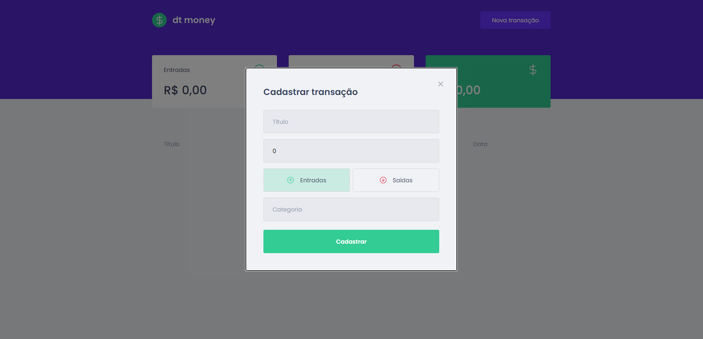
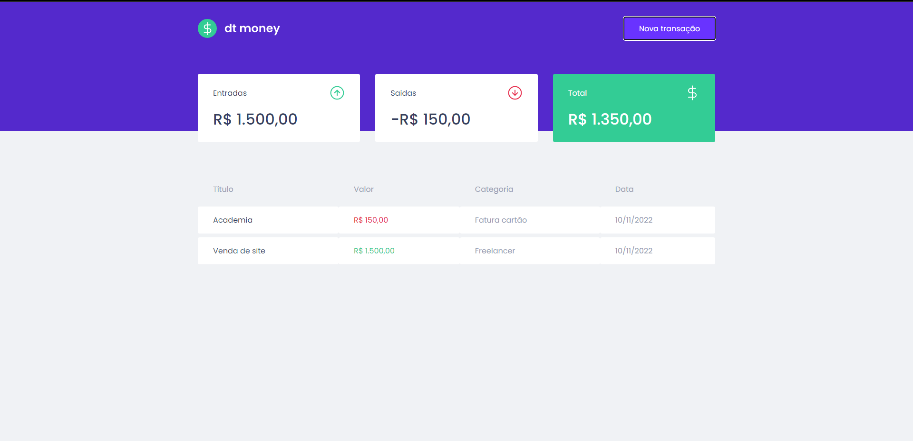

<h1 align="center">Rocketseat | Ignite Project | dtMoney</h1>

<h2>Fonte utilizada</h2>

* [Poppins](https://fonts.google.com/specimen/Poppins)


<h2>Comandos para rodar a aplicação no teu PC</h2>

``` ruby

  yarn install

```

Instala as dependências


```  ruby

  yarn start 

```

Inicia a aplicação


<h2>Dependencias</h2>

``` css
  
  yarn add miragejs

```

MirageJs simula uma API fictícia 


``` css 
  
  yarn add axios

```

Requisição bem mais resumida que o fecth ]

``` java
  
  yarn add react-modal

```

Lib para aplicar modals


``` css
  
  
  yarn add polished

```

Lib com funções de js prontas para usar em styled components


<h1 align="center">Como a aplicação funciona...</h1>

<strong>A aplicação mostra cotação de gastos e ganhos</strong>

<h3 align="center">Dashboard</h3>
<div align="center">
  
</div>

<h3 align="center">Cadastro de informações</h3>
<div align="center">
   
</div>


<h3 align="center">Resultado no dashboard ao incluir informações</h3>
<div align="center">
   
</div>


Desenvolvido por [Rodrigo](https://github.com/rdg-404) <br>
Aplicação feita no Ignite, programa de especialização da Rocketseat
